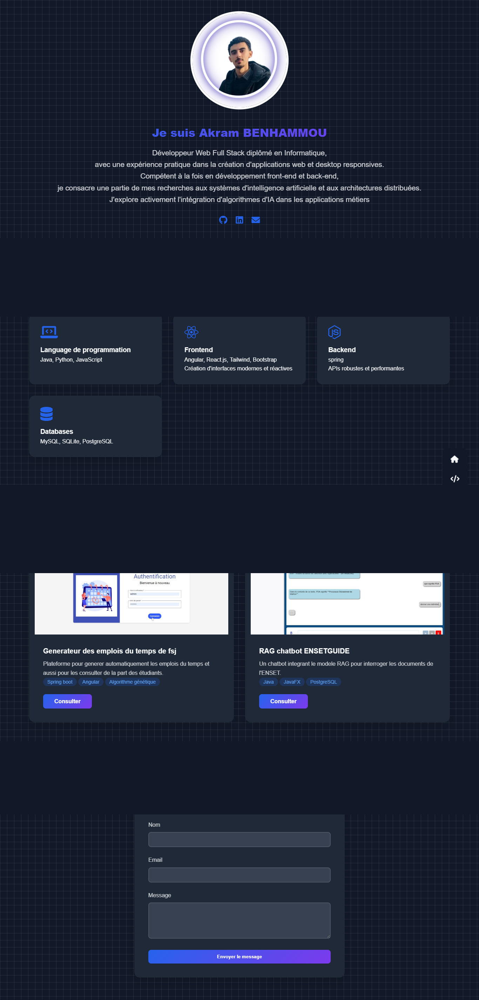
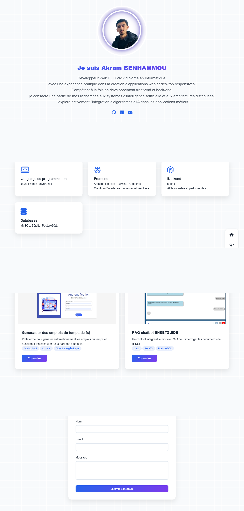

# Portfolio Personnel - Akram BENHAMMOU

Un portfolio moderne et responsive présentant mes compétences et projets en tant que développeur web full stack.

## 🚀 Caractéristiques

- Design moderne et minimaliste
- Mode sombre/clair
- Navigation fluide
- Interface responsive
- Animations subtiles
- Formulaire de contact intégré

## 👀 Vue d'ensemble
### Mode sombre



### Mode claire



## 🛠️ Technologies Utilisées

- HTML5
- CSS3
- Font Awesome (pour les icônes)
- Netlify (pour le formulaire de contact)

## 📱 Sections

1. **Accueil**
   - Photo de profil
   - Introduction personnelle
   - Liens vers les réseaux sociaux (GitHub, LinkedIn, Email)

2. **Compétences**
   - Langages de programmation (Java, Python, JavaScript)
   - Frontend (Angular, React.js, Tailwind, Bootstrap)
   - Backend (Spring)
   - Bases de données (MySQL, SQLite, PostgreSQL)

3. **Projets**
   - Générateur d'emplois du temps FSJ
   - RAG chatbot ENSETGUIDE

4. **Contact**
   - Formulaire de contact intégré avec Netlify

## 🎨 Personnalisation

Le site utilise des variables CSS pour une personnalisation facile des couleurs :

```css
:root {
    --primary-color: #2563eb;
    --secondary-color: #7c3aed;
    --accent-color: #f97316;
    --dark-color: #1f2937;
    --light-color: #f8fafc;
}
```

## 📱 Responsive Design

Le portfolio est entièrement responsive avec des points de rupture pour :
- Mobiles (max-width: 480px)
- Tablettes (max-width: 768px)
- Desktop (>768px)

## 🔧 Installation

1. Clonez ce dépôt
```bash
git clone [https://github.com/AkramBENHAMMOU-e/Portfolio]
```

2. Ouvrez `index.html` dans votre navigateur

## 💡 Fonctionnalités Spéciales

- Navigation fixe sur le côté droit (desktop)
- Navigation en bas de l'écran (mobile)
- Transition fluide entre les modes clair/sombre
- Effets de survol sur les cartes de projets
- Formulaire de contact fonctionnel avec Netlify


## 📞 Contact

- GitHub: [@AkramBENHAMMOU-e](https://github.com/AkramBENHAMMOU-e)
- LinkedIn: [Akram BENHAMMOU](https://www.linkedin.com/in/akram-benhammou-a888a9221/)
- Email: benhammou.akrm4@gmail.com